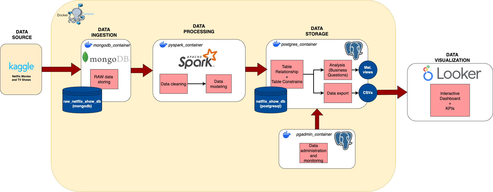

# Extract, Transform, Load (ETL)

In this project we simulate a data workflow in which the original raw data is already stored in a Mongo database (`raw_netflix_show_db`) and where all data transformations are executed using pyspark (python API of Spark). The ETL process finishes by exporting the transformed data into a PostgreSQL database (`netflix_show_db`).

## Extract
Hence, our ETL process begins by gathering (_Extract_) data from MongoDB. We achieve this by creating a spark session and specifying the connection address (both for _read_ and _write_ options). Notice that Spark requires a series of "connector" (or ".jar") files that allows interactions Spark-MongoDB, these can be manually retrieved at the Maven Repository (see [Maven/Spark-mongo_connector](https://mvnrepository.com/artifact/org.mongodb.spark/mongo-spark-connector)).
In our case, the spark session is pre-configured to automatically download the necessary packages.
Once data is accesible we retrieve all documents in the specific collection and store it as a Spark Dataframe (these are similar to _Pandas_ Dataframe).

>Notice that all connection details for MongoDB and PostreSQL database are stored in `config.json` file (see [config.json](../ETL/config.json)).'

## Transform
Once data has been imported into Pyspark, we proceed by performing of data cleaning and formatting steps. More specifically:
- Replace all wrongly parsed null values 
> When importing data from MongoDB all `NULL` values are read as `{"$numberDouble": "NaN"}`. We have not determined the source if this issue yet. So it has been bypassed by manually replacing these values.
- Remove all entries that contains `NULL` values.
- Split data into Fact (`shows`) and Dimension (`directors`, `countries`...) tables.
- Flattening: Transform multi-value columns into single value columns (`directors`, `casting`).
- Generate custom key columns. Ex: `dt00209` for director `Jeff Gill`
- Create intermediate relational tables. Ex: `rt_show_directors` that relates `show_id` with `director_id`

In this project we decided to implement a Snowflake data schema in which data is normalized and split into multiple tables. 
This guarantees no data duplication, data integrity, enhances data warehouse scalability. However, when querying data we require to join multiple tables in order to retrieve the desired data.

Notice that the data cleaning process cannot account for non-systematic error in data such as misspelled names or other anomalies. 
If we detect a specific pattern in these erros we can create a specific procedure to correct them, if not we can apply manual corrections to data later in the workflow (for instance directly from postgreSQL).
An alternative is to check data quality by comparing it to a reference dataset (which we assume correct). This can take the form of another independent "csv" or by comparing to online websites such as IMDB or RottenTomatoes.

## Load

After data has been properly cleaned and formated we can export processed data into our PostgreSQL database. For that we provide all the necessary connection details (stored in [config.json](../ETL/config.json)) and specify the table name. Spark will automatically handle the field name and data type.
Nonetheless, Spark cannot (at least to our knowledge) set table keys (i.e. _primary_ and _foreign_ keys) or any _constrains_, i.e. behaviours upon data modification. These need to be configured directly from our PostgreSQL instance.
In our case, we listed all the necessary SQL commands for setting up these parameters in [create_table_relations.sql](../SQL/create_table_relations.sql) file.