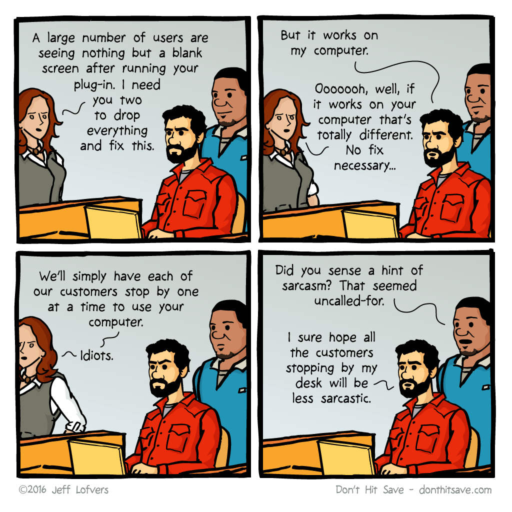

# Architecture

In this project data moves through different components that require some level of configuration to be production ready (Ex: SPARK and its environmental variables).
We decided to implement a fully containerized approach to facilitate the execution and replication of this project on any platform by using Docker containers and, at a higher level, 
Docker-compose to run multiple containers simultaneously. This approach can prevent the classic issue of "It works in my computer".

The docker environment is sufficiently automated to avoid the need to manually install software, packages and any other requirement facilitating the user experience. 
Yet, it is also purposely not automated in some aspects for showcasing purposes, where we deliberately guide the user through a series to execution steps to better understand the data-workflow (see [How to run](../README.md#how-to-run))

You can check the specific configuration implemented in our Docker environment by inspecting the [docker-compose.yml](../docker-compose.yml) and [Dockerfile](../Dockerfile) files.
The _docker-compose_ file handles all the different containers or "services" that are used in this project. Specifically, there are four services called _pyspark_, _mongodb_, _postgres_ and _pgadmin_. When running the command `docker-compose up -d` docker will read this file and download the required images and create the different containers and volumes.
The _pyspark_ service is built base on the instructions of the _Dockerfile_. 

In the *Dockerfile* we first retrieve a pre-configure image (see [Docker-hub: bitnami/spark](https://hub.docker.com/r/bitnami/spark)) that has a working version of SPARK (v.3.5.5) and then, we install python and all the necessary libraries that are listed in [requirements.txt](../requirements.txt). 
This image contains the same configuration that we use in our development environment, so it can be re-utilised to test the specific portions of the python code used in this project.

All containers can interact between them if the proper connection details are provided. In this regard, the _pgadmin_ service utilises [servers.json](../servers.json) file where the connection details to the PostgreSQL database are stored.

The only part of this project that is not containerized is the Visualization block that, in our case, operates in the cloud (see [Looker Studio](https://lookerstudio.google.com/overview)). This part of the work can be replaced by other data visualization tools such as _Power BI_ ([Power BI](https://www.microsoft.com/en-us/power-platform/products/power-bi)), _Tableau_ ([Tableau](https://www.tableau.com/fr-fr)) or _IBM cognos_ to name a few ([IBM cognos](https://www.ibm.com/products/cognos-analytics)).

Notice that this project has no orchestration/monitoring tools implemented. 
This is due to the rather linear and simplistic workflow in which the entire project is run a single time (This could change posterior releases of this project).

Also, security measures are rather limited: there is a single user/password to access the different databases used, there are no roles with limited permissions and, regarding data availability, there is no data replication strategy implemented nor there is any secure remote access to data.
Implementing all these measures would over-complicate the project. Yet, these are necessary aspects to consider when building any data infrastructure.